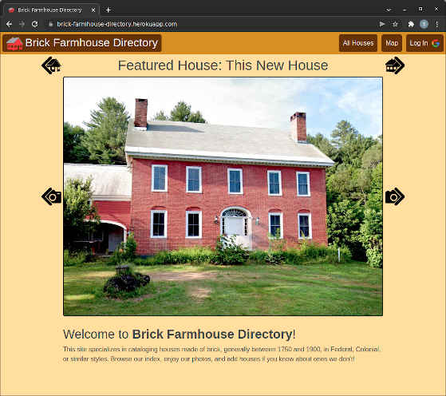
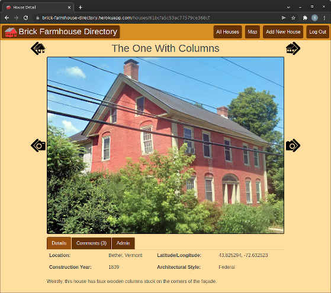
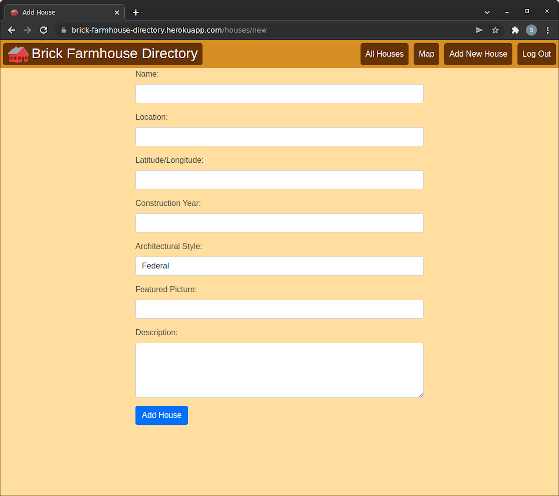
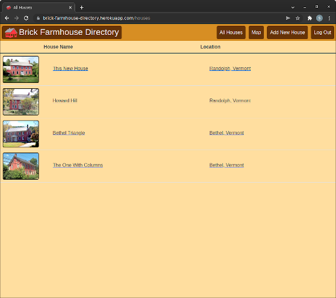
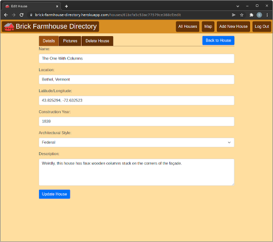
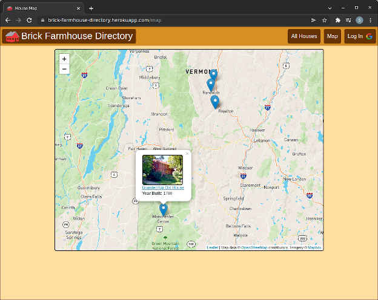

# Brick Farmhouse Directory
Brick Farmhouse Directory is an application designed to host an index of houses (specifically, brick farmhouses, generally in New England, generally built between 1750 and 1900). This app was built to satisfy the requirements of Project 2 of GA's SEIR-11-08-21.

Some features of this app are overbuilt for its size. For instance, the "House" objects are a Linked List for the navigation buttons, which reduces database load by storing the "next" and "previous" House IDs in each House object (so you don't need to query the database for a list of all houses and then find the "next" and "previous" houses on the fly), but increases the up-front code complexity, as well as the chance of things breaking down the line (e.g., there is no mechanism to validate or rebuild the Linked List [although that could certainly be added later]).

This app was designed for real-world deployment. One major holdup preventing that is an almost total lack of data validation.

## Screenshots:

## Technologies Used:
- __JavaScript__
- __Node.js__
- __MongoDB__
- __Mongoose__
- __CSS__
- __Bootstrap__
- __HTML__
- __Google OAuth2__

## Getting Started:
View the app as deployed on Heroku: <https://brick-farmhouse-directory.herokuapp.com/>

Check out the Trello board: <https://trello.com/b/Ylw9AQyH/brick-farmhouse-directory>

### Visitor usage:
[Visit the site](https://brick-farmhouse-directory.herokuapp.com/). From the Home page you can view pictures of the Featured House using the "Next Picture" and "Previous Picutre" buttons next to the Featured Picture, or browse to other houses using the "Next House" and "Previous House" buttons above the picture. View the complete list of houses from the "All Houses" button at the top of the page. View the details of a house by clicking its entry in the index.

On the Details page you can see the details about the house, including the description. You can click on the "Comments" tab to view the comments.

### User Usage
Click the "Log In" button to access additional functionality. You can add new houses with the "Add House" button at the top of the page. You can add and delete (your own) comments from the House Detail page's "Comments" tab. There is a new "Admin" tab on the Detail page where you can access additional house administration functions, including the "Add Picture" function and, if you are the user who added the house, the "Edit/Delete" button, which takes you to the "Edit House" page containing additional administrative functionality.

## Next Steps:
- Data Validation
- Non-Google sign-in option(s)
- Extended House Characteristics
- Implement "User" page to view/manage all your houses/pictures/comments from one place
- "View All Images" page with thumbnails of all images from all houses.
- Mobile design